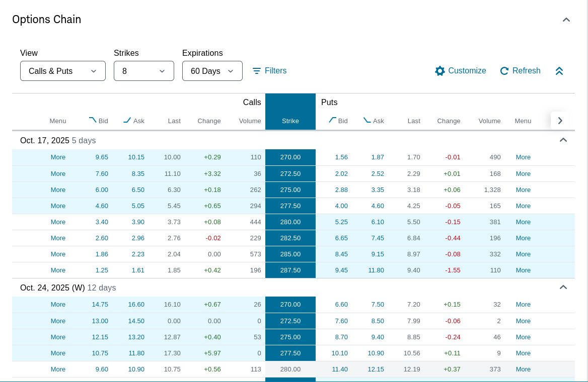

```{r setup, include=FALSE}
knitr::opts_chunk$set(echo = TRUE)
require(tidyverse)
pretty <- function(x, n=2) format(round(x, n), big.mark=',')
pv <- function(r, c=1, t=1, m=1) c / (1 + r/m)^(m*t)
```

# 22.1 Options

An __option__ is a financial contract that gives the owner the right, but not
the obligation, to do something.

* _Exercising the option_ is the act of buying or selling the underlying asset
  via the option contract.

* _Strike price_ or, _exercise price_, is the price the option contract can be
  executed.

* _Expiration date_ The maturity date of the option; after this date, the option
  is dead.

* _American and European options_ An American option may be exercised at anytime
  up until the expiration date. A European option can only be exercised on the
  expiration date.

# 22.2 Call options

A call option gives the owner the right to buy an asset at a fixed price during
a particular period.

## The value of a call option at expiration

The value of a call option at expiration is

\[
\begin{aligned}
\text{Option value} = \begin{cases}
    \text{Spot} - \text{Strike},\ \ &\text{Spot} > \text{Strike}\\
    0\ \ &\text{otherwise}
\end{cases}
\end{aligned}
\]

```{r figure 22.1; call options diagram, echo=F}
f22.1 <- new.env()
f22.1$x <- 1:200
f22.1$y <- function(x) ifelse(x<100, 0, x-100)
plot(f22.1$x, f22.1$y(f22.1$x), type='l',
    xlab="Value of common stock at expiration ($)",
    ylab="Value of call option at expiration ($)",
    main="The value of a call option on the expiration date.")
```

### Example 22.1: Call option payoffs

Suppose Mr. Optimist holds a one-year call option on TIX common stock. It is a
European call option and can be exercised at \$150. Assume that the expiration
date has arrived. What is th evalue of the TIX call option on the expiration
date? If TIX is selling for \$200 per share, Mr. Optimist can exercise the
option---purchase TIX at \$150---and then immediately sell the share at \$200.
Mr. Optimist will have made \$50 ($=\$200 - \$150$). Thus, the price of this
call option must e \$50 at expiration.

Instead assume that TIX is selling for \$100 per share on the expiration date.
If Mr. Optimist sill holds the call option, he will throw it out. The value of
the TIX call option on the expiration date will be zero in this case.

# 22.3 Put options

A put option is the opposite of a call option. It gives the owner the right, but
not the obligation to sell the underlying asset at a strike price.

## The value of a put option at expiration

The value of a put option at expiration is

\[
\begin{aligned}
\text{Option value} = \begin{cases}
    \text{Strike} - \text{Spot},\ \ &\text{Spot} < \text{Strike}\\
    0 \ \ &\text{otherwise}
\end{cases}
\end{aligned}
\]

```{r figure 22.2; put option diagram, echo=F}
f22.2 <- new.env()
f22.2$x <- 1:100
f22.2$y <- function(x) ifelse(x<50, 50-x, 0)
plot(f22.2$x, f22.2$y(f22.2$x), type='l',
     xlab="Value of common stock at expiration ($)",
     ylab="Value of put option at expiration ($)",
     main="The value of a put option on the expiration date.")
```

### Example 22.2: Put option payoffs

Ms. Pessimist believes that BMI will fall from its current \$160 per-share
price. She buys a put. Her put option contract gives her the right to sell a
share of BMI stock at \$150 one year from now. If the  price of BMI is \$200 on
the expiration date, she will tear up the put option contract because it is
worthless. That is, she will not want to sell stock worth \$200 for the exercise
price of \$150.

On the other hand, if BMI is selling for \$100 on the expiration date, she will
exercise the option. In this case she can buy a share of BMI in the market for
\$100 per share and turn around and sell the share at the exercise price of
\$150. Her profit will be \$50 ($=\$150 - \$100$). Therfore, the value of the
put option on the expiration date will be \$50.

---

# 22.4 Selling Options

An investor who sells (or _writes_) a call on an asset has the obligation to
deliver the asset to the option holder if required.

If, at expiration, the value of the asset is greater than the strike price of
the option, the holder will exercise the call and the seller must give the
holder the asset.

The seller is offered a preimum to undergo this obligation.

```{r figure 22.3; selling options, echo=F, fig.height=3, fig.width=3}
f22.3 <- new.env()
f22.3$x <- 1:100
f22.3$y.call <- function(x) ifelse(x<50, 0, 50-x)
f22.3$y.put <- function(x) ifelse(x<50, -50+x, 0)
f22.3$y.buy <- function(x) x
plot(f22.3$x, f22.3$y.call(f22.3$x), type='l',
     xlab="", ylab="")
#    xlab="Share price at expiration ($)",
#    ylab="Value of seller's position at expiration ($)",
#    main="Sell a call")
plot(f22.3$x, f22.3$y.put(f22.3$x), type='l',
     xlab="", ylab="")
#    xlab="Share price at expiration ($)",
#    ylab="Value of seller's position at expiration ($)",
#    main="Sell a put")
plot(f22.3$x, f22.3$y.buy(f22.3$x), type='l',
     xlab="", ylab="")
#    xlab="Share price ($)",
#    ylab="Value of a share of common stock ($)",
#    main="Buy a common stock")
```

# 22.5 Option Quotes



# 22.6 Combinations of options

Puts and calls can serve as the building blocks for more complex option
contracts.

```{r figure 22.4, echo=F, fig.width=3, fig.height=3}
f22.4 <- new.env()
f22.4$x <- 1:100
f22.4$buy <- function(x) x
f22.4$put <- function(x) ifelse(x<50, 50-x,0)
f22.4$comb <- function(x) f22.4$buy(x) + f22.4$put(x)
plot(f22.4$x, f22.4$buy(f22.4$x), type='l',
     xlab="", ylab="")
plot(f22.4$x, f22.4$put(f22.4$x), type='l',
     xlab="", ylab="")
plot(f22.4$x, f22.4$comb(f22.4$x), type='l',
     xlab="", ylab="", ylim=c(0, 75))
```

The strategy of buying a put and buying the underlying stock is called a
_protective put_. It is as if we are buying insurance on the stock. Note that
the combination of buying a put and buying the underlying stock has the same
_shape_ in Figure 22.4 as the call purchase in Figure 22.1.

The __put-call parity__ relationship:

\[
\text{Stock price} + \text{Put price} = \text{Call price}
    + \text{PV}(\text{Bond})
\]

What this states is that the current price of a stock plus the current price of
put option on the stock is equal to the current price of a call option on the
stock plus the present value of a zero-coupon bond that matures at expiration
time of the two options. The zero-coupon bond is used to mimic the strike price
of the options at expiration.

### Example 22.3 A Synthetic T-Bill

Suppose shares of stock in Smolira Corp. are selling for \$110. A call option on
Smolira with one year to maturity and a \$110 strike price sells for \$15. A put
with the same terms sells for \$5. What's the risk-free rate?

To answer, we need to use put-call parity to determine the price of a risk-free,
zero coupon bond:

$$
\text{Price of underlying stock} + \text{Price of put}
  - \text{Price of call} = \text{Present value of exercise price}
$$

Plugging in the numbers, we get:

$$
\$110 + \$5 - \$15 = \$100
$$

Because the present value of the \$110 strike price is \$100, the implied
risk-free rate is 10 percent.

$$
X = \frac{110}{100} = 1.1
$$

# 22.7 Valuing options

## Bounding the value of a call

### Lower bound

When valuing call options consider the fact that if the value of the option is
less than the difference between the stock price and the exercise price, an
arbitrage opportunity exists. For example, consider a stock price of \$60 and
the exercise price is \$50. If the option sells at \$9 then:

1. Buy the call option for \$9
2. Exercise the call and obtain the stock for \$50
3. Sell the stock for the current market price \$60

The profit will be \$1.

These opportunities rarely exist, at least not for very long. Most of the time
the option is likely to be priced above the difference price (here \$10). This
difference price is called the _intrinsic value_ of the option. If the option is
selling for \$12. Then the intrinsic value is \$10, and the _time premium_ is
\$2. The time premium represents the extra amount that investors are willing to
pay because of the possibility that the stock p rice will rise before theoption
expires.

### Upper bound

The upper bound of a stock option is the price of the underlying stock. That is
the stock itself. The option to buy a common stock cannot have a greater value
than the common stock itself.

\[
\text{Upper bound} = \text{Price of stock}\\\\
\text{Lower bound} = \text{Price of stock} - \text{Exercise price}
\]

## The factors determining call/put option values

| Increase in | Call option value effect | Put option value effect |
|:---|:---:|:---:|
| Value of underlying asset (stock price) | + | - |
| Exercise price | - | + |
| Stock volatility | + | + |
| Interst rate | + | - |
| Time to expiration | + | + |

In addition to the preceding, we have presented the following four relationships
for American calls:

1. THe call price can never be greater than the stock price (_upper bound_).
2. The call price can never be less than either zero or the difference between
   the stock price and the exercise price (_lower bound_).
3. The call is worth zero if the stock is worh zero.
4. When the stock price is much greater than the exercise price, the call price
   tends toward the difference between the stock price and the present value of
   the exercise price.

# 22.8 An option pricing formula

The value of a call option is a function of five variables:

1. The current price of the underlying asset (stock price).
2. The exercise price.
3. The time to the expiration date.
4. The variance of the underlying asset.
5. The risk-free interest rate.

The Black-Scholes model is used to quantitatively value an option.

## A two-state option model

iSuppose the current market price of a stock is \$50 and the stock will either
be \$60 or \$40 at the end of the year. Further, imagine a call option on this
stock with a one-year expiration date and a \$50 exercise price. Investors can
borrow at 10 percent. Our goal is to determine the vlaue of the call.

To value the call we can deploy two strategies: The first strategy is to simply
buy the call. The second is to:

1. Buy one-half a share of stock.
2. Borrow \$18.18, implying a payment of principal and interest at the end of
   the year of \$20 ($=\$18.18 \times 1.10$).

The cash flows from the second strategy match the cash flow from buying the call
option. Because the cash flows match, we say that we are _duplicating_ the call
with the second strategy.

| Initial transactions | If stock price is \$60 | If stock price is \$40 |
|:---|---:|---:|
| 1. Buy a call | \$60 - \$50 = \$10 | \$ 0 |
| 2. Buy $\frac{1}{2}$ share of stock | $\frac{1}{2} \times \$60 = \$30$ |
$\frac{1}{2} \times \$40 = \$20$ |
| Borrow \$18.18 at 10\% | $-(\$18.18 \times 1.10) = -\$20$ | $-\$20$ |
| Total from stock and borrowing strategy | $\$10$ | \$ 0 |

### Determining the delta

How did we know to buy one-half share of stock in the duplicating strategy? The
call price at the end of the year will be either \$10 or \$0, whereas the stock
price will be either \$60 or \$40. Thus, the call price has a potential swing of
\$10 ($=\$10 - \$0$) next period, whereas the stock price has a potential swing
of \$20 ($=\$60 - \$40$). We can write this in terms of the following ratio:

\[
\text{Delta} = \frac{\text{Swing of call}}{\text{Swing of stock}}
  = \frac{\$10 - \$0}{\$60 - \$40} = \frac{1}{2}
\]

This is called the _delta_ of the call. A \$1 swing in the price of the stock
gives rise to a \$.50 swing in the price of the call. Because we are trying to
duplicate the call with the stock, it seems sensible to buy one-half share of
stock instead of buying one call. In other words, the risk of buying one-half
share of stock should be the same as the risk of buying one call.

### Determining the amount to borrow

Buying one-half share of stock brings us either \$30 or \$20 at expiration,
which is exactly \$20 more than the payoffs of \$10 and \$0, respectively, from
the call. To duplicate the call through a purchase of stock, we should also
borrow enough moeny so that we have to pay back exactly \$20 of interest and
principal. This amount of borrowing is merely the present value of \$20, which
is \$18.18 ($=\$20/1.10$).

The value of the call is thus:

\[
\begin{aligned}
\text{Value of the call} &= \text{Stock price} \times \text{Delta}
    - \text{Amount borrowed}\\
\$6.82 &= \$50 \times \frac{1}{2} - \$18.18
\end{aligned}\tag{22.2}
\]

### Risk-neutral valuation

The value of the option is not determinant of the movement of the stock price.
Regardless if the price of the underlying stock moves up or down, the value of
the option is the same.

If we don't need the probabilities of the two states to value the call, perhaps
we can select _any_ probabilities we want and still come up with the right
answer.

Suppose we selected probabilities such that the expected return on the stock is
equal to the risk-free rate of 10 percent.

The stock return given a rise in the stock's price is 20 percent
($=\$60/\$50 - 1$) and the stock return given a fall in the stock's price is -20
percent ($=\$40/\$50 - 1$). Thus, we can solve for the probability of a rise
necessary to achieve an expected return of 10 percent as follows:

\[
\begin{aligned}
10\% &= \text{Probability of a rise} \times 20\%
    + (1 - \text{Probability of a rise} \times -20\%\\\\
.1 &= P \times .2 + (1 - P) \times (-.2)\\
.1 &= .2P - .2 + .2P\\
.3 &= .4P\\
P  &= \frac{3}{4}
\end{aligned}
\]

Therefore, the probability of a rise in stock price is $\frac{3}{4}$ and the
probability of a fall in the stock price is $\frac{1}{4}$.

If we apply these probabilities to the call, we can value it as:

\[
\text{Value of call} =
    \frac{\frac{3}{4} \times \$10 + \frac{1}{4} \times \$0}{1.10}
    = \$6.82
\]

We selected probabilities that made the expected return equal to the risk-free
rate so that we can analyize the special case that the investors are
_risk-neutral_.

To sum up there are two ways to value a call option:

1. Determine the cost of a strategy duplicating the call. This strategy involves
   an investment in a fractional share of the stock financed by partial
   borrowing.

2. Calculate the probabilities of a rise and a fall in stock prices under the
   assumption of risk neutrality. Use these probabilities in conjunction with
   the risk-free rate to discount the payoffs of the call at expiration.

## The Black-Scholes model

The fundamental insight of the Black-Scholes model is to shorten the time
period. A specific combination of stock and borrowing can duplicate a call
option over an infinitesimal time horizon. Because the stock price will cahnge
over the first instant, another combination of stock and borrowing is needed to
duplicate the call over the second instant and so on. By doing this the
Black-Scholes Model can:

1. determine the duplicating combination at any moment
2. value the option based on this duplicating strategy.

\[
\begin{aligned}
\textbf{Black-Scholes Model}\\
C = SN(d_1) - E e^{-Rt} N(d_2)
\end{aligned}
\]

where:

$d_1 = [\ln{(S/E)} + (R + \sigma^2/2)t]/\sqrt{\sigma^2 t}$  
$d_2 = d_1 - \sqrt{\sigma^2 t}$

This formula for the value of a call, $C$, is one of the most complex in
finance. However, it involves only five parameters:

1. $S$: Current stock price.
2. $E$: Exercise price call.
3. $R$: Annual risk-free rate of return, continuously compounded.
4. $\sigma^2$: Variance (per year) of the continuous return on the stock.
5. $t$: Time (in years) to expiration date.

In addition, there is this statistical concept:

\begin{center}
\( N(d) \) = Probability taht a standardized, normally distributed, randon
variable will be less than or equal to $d$.
\end{center}

### Example 22.4 Black-Scholes

Consider Private Equipment Company (PEC). On October 4 of Year 0, the PEC April
29 call option had a closing value of \$4. The stock itself was selling at \$50.
On October 4, the option had 199 days to expiration (maturity date = April 21,
Year 1). The annual risk-free interest rate, continuously compounded, was 7
percent.

This information determines three variables directly:

1. The stock price, $S$, is \$50.
2. The exercise price, $E$, is \$49.
3. The risk-free rate $R$, is .07.
4. The time to maturity $t$, is $199/365$.

In the real world, an option trader would know $S$ and $E$ exactly. Traders
generally view U.S. Treasury bills as riskless, so a current quote from The Wall
Street Journal or a similar source would be obtained for the interest rate. The
trader would also know (or could count) the number of days to expiration
exactly. Thus, the fraction of a year to expiration, $t$, could be calculated
quickly.

The problem comes in determining the variance of the stock's return. The formula
calls for the variance between the purchase date of October 4 and the expiration
date. Unfortunately, this represents the future, so the correct value for
variance is not available. Instead, traders frequently estimate variance from
past data, just as we calculated variance in an earlier chapter. In addition,
some traders may use intuition to adjust their estimate. For example, if
anticipation of an upcoming event is likely to increase the volatility of the
stock, the trader might adjust her estimate of variance upward to reflect this.
(This problem was most severe right after the October 19, 1987 crash. The stock
market was quite risky in the aftermath, so estimates using precrash data were
too low.)

The preceding discussion was intended merely to mention the difficulties in
variance estimation, not to present a solution. For our purposes, we assume that
a trader has come up with an estimate of variance.

5. The variance of Private Equipment Co. has been estimated to be .09 per year.

Using these five parameters, we calculate the Black-Scholes value of the PEC
call option in three steps:

* Step 1: Calculate $d_1$ and $d_2$. These values can be determined by a
  straightforward, albeit tedious insertion of our parameters into the basic
  formula. We have:

$$
\begin{aligned}
d_1 &= \left[ \ln{\left(\frac{S}{E}\right)} + (R + \sigma^2/2)t \right] / \sqrt{\sigma^2 t}\\
  &= \left[ \ln{\left(\frac{50}{49}\right)} + (.07 + .09/2) \times \frac{199}{365} \right] 
    / \sqrt{.09 \times \frac{199}{365}}\\
  &= [ .0202 + .0627]/.2215\\
  &= .3742\\\\
d_2 &= d_1 - \sqrt{\sigma^2 t}\\
  &= .1527
\end{aligned}
$$

* Step 2: Calculate $N(d_1)$ and $N(d_2)$. We can best understand the values
  $N(d_1)$ and $N(d_2)$ as the cumulative probability. We use a normal
  distribution with an expected value of 0 and a standard deviation of 1. This
  is called the __standardized normal distribution__. We mentioned in an earlier
  chapter that the probability that a drawing from this distribution will be
  between $-1$ and $+1$ (within one standard deviation of its mean, in other
  words) is $68.26$ percent.

Now let us ask a different question: What is the probability that a drawing from
the standardized normal distribution will be _below_ a particular value? For
example, the probability that a drawing will be below 0 is clearly 50 percent
because the normal distribution is symmetric. Using statistical terminology, we
say that the __cumulative probability__ of 0 is 50 percent. Statisticians also
say that $N(0) = 50\%$.

### Using `R` to calculate normal distributions

We use the normal distribution function (Cumulative Distribution Function),
`pnorm`, to calculate $N(d_1)$ and $N(d_2)$.

```{r Example 22.4: Black-Scholes: finding normal distribution values}
d.1 <- .3742
d.2 <- .1527

pnorm(d.1)
pnorm(d.2)
```

Step 3: Calculate C.

$$
\begin{aligned}
C &= S \times N(d_1) - E e^{-Rt} \times N(d_2)\\
  &= \$50 \times N(d_1) - \$49 e^{-.07 \times (199/365)} \times N(d_2)\\
  &= (\$50 \times .6459) - (\$49 \times .9626 \times .5607)\\
  &= \$32.295 - \$26.447\\
  &= \$5.85
\end{aligned}
$$

We can compare the Black-Scholes model to the two-state model:

\[
\begin{aligned}
C &= S &\times N(d_1) &- Ee^{-Rt}N(d_2)\\
\text{Value of call} &= \text{Stock price} &\times \text{Delta}
  &- \text{Amount borrowed}
\end{aligned}
\]

The importance of the Black-Scholes model is in the fact that we can calculate
the value of an option given five parameters. Four of the parameters: The
current price of stock, $S$; the exercise price, $E$; the interest rate $R$; and
the time to expiration date, $t$. are directly observable. The fifth parameter,
variance of the return, $\sigma^2$, is the only estimated parameter.

# 22.9 Stocks and bonds as options

### Example 22.5 Stocks and bonds as options

The Popov Company has been awarded the concessions at next year's Olympic Games
in Antarctica. Because the firm's principals live in Antarctica and because
there is no other concession business on that continent, their enterprise will
disband after the games. The firm has issued debt to help finance this venture.
Interest and principal due on the debt next year will be \$800, at which time
the debt will be paid off in full. The firm's cash flows next year are forcast
as follows:

```{r example 22.5: stocks and bonds as options: table, echo=F}
m <- matrix(nrow=2, c(1000, -800, 850, -800, 700, -700, 550, -550))
csums <- colSums(m)
m <- rbind(m, csums)
rownames(m) <- c("Cash flow before interest and principal", "- interest and principal",
                 "Cash flow to stockholders")
colnames(m) <- c("Very Successful Games", "Moderately Successful Games", "Moderately Unsuccessful Games",
                 "Outright Failure")
knitr::kable(m, caption="Example 22.5: Popov's Cash Flow Schedule")
```

As can be seen, the principals forecast four equally likely scenarios. If either
of the first two scenarios occurs, the bondholders will be paid in full. The
extra cash flow goes to the stockholders. However, if either of the last two
scenarios occurs, the bondholders will not be paid in full. Instead, they will
receive the firm's entire cash flow, leaving the stockholders with nothing.

The following sections describe both the stockholder and bondholder positions on
The Popov Company from an options perspective.

### The firm expressed in terms of call options

#### The stockholders

Stock can be viewed as a call option on the firm.

```{r figure 22.11, echo=F, fig.width=5, fig.height=5}
f22.11 <- new.env()
f22.11$x <- 1:820
f22.11$f <- function(x) ifelse(x<800, 0, x-800)
plot(f22.11$x, f22.11$f(f22.11$x), xlab="", ylab="", type='l',
    ylim=c(-20,20), xlim=c(750, 850))
   
```

\begin{center}
\textbf{Figure 22.11}: Cash flow to stockholders of Popov Company as a function
of cash flow to the firm
\end{center}

If the cash flows of the firm exceed \$800, the stockholders pay \$800 in order
to receive the firm's cash flows. If the cash flows of the firm are less than
\$800, the stockholders do not exercise their option. THey walk aaway from the
firm, receiving nothing.

The underlying asset that the option is based on is the firm itself. We can biew
the _bondholders_ as owning the firm. The stockholders have a call option on the
firm with an exercise price of \$800.

#### The bondholders

The position of the bondholders can be described by two claims:

1. They own the firm.
2. They have written a call on the firm with an exercise price of \$800.

The stockholders walk away fromt the firm if cash flows are less than \$800 and
the bondholders retain ownership. However, if the cash flows are ggreater than
\$800, the stockholders exercise their option. They call the stock away from the
bondholders for \$800.

### The firm expressed in terms of put options

#### The stockholders

The position of the stockholders can be expressed by three claims:

1. They own the firm.
2. They owe \$800 in interest and principal to  the bondholders.
3. The stockholders own a put option on the firm with an exercise price of
   \$800. The group of bondholders is the seller of the put.

Now consider two possibilities:

1. __Cash flow is less than \$800:__ Because the put has an exercise price of
   \$800, the put is in the money. The stockholders "put"---that is, sell---the
   firm to the bondholders. Normally, the holder of a put receives the exercise
   price when the asset is sold. However, the stockholders already owe \$800 to
   the bondholders. Thus, the debt of \$800 is simply canceled---and no money
   changes hands---when the stock is delivered to the bondholders. Because the
   stockholders give up the stock in exchange for extinguishing the debt, the
   stockholders end up with nothing if the cash flow is below \$800.

2. __Cash flow is greater than \$800:__ Because the put is out of the money
   here, the stockholders do not exercise. Thus, the stockholders retain
   ownership of the firm but pay \$800 to the bondholders as interest and
   principal.

#### The bondholders

The position of the bondholders:

1. The bondholders are owed \$800.
2. They have sold a put option on the firm to the stockholders with an exercise
   price of \$800.

1. __Cash flow is less than \$800:__ As mentioned before, the stockholders will
   exercise the put in this case. This means that the bondholders are obligated
   to pay \$800 for the firm. Because they are owed \$800, the two obligations
   offset each other. Thus, the bondholders simply end up with the firm in this
   case.

2. __Cash flow is greater than \$800:__ Here, the stockholders do not exercise
   the put. Thus, the bondholders merely receive the \$800 that is due to them.

Expressing the bondholders' position in this way is illuminating. With a
riskless default-free bond, the bondholders are owed \$800. Thus, we can express
the risky bond in terms of a riskless bond and a put:

\[
\text{Value of risky bond} = \text{Value of default-free bond}
    - \text{Value of put option}
\]

That is, the value of the risky bond is the value of the default-free bond less
the value of the stockholders' option to sell the company for \$800.

### A resolution of the two views

Here is a summary of the two views:

\begin{center}
\textbf{Positions viewed in terms of call options}
\end{center}

\textbf{Stockholders}

1. Stockholders own a call on the firm with an exercise price of \$800.

\textbf{Bondholders}

1. Bondholders own the firm.

2. Bondholders have sold a call on the firm to the stockholders.

\begin{center}
\textbf{Positions viewed in terms of put options}
\end{center}

\textbf{Stockholders}

1. Stockholders own the firm.

2. Stockholders owe \$800 in interest and principal to bondholders.

3. Stockholders own a put option on the firm with an exercise price of \$800.

\textbf{Bondholders}

1. Bondholders are owed \$800 in interest and principal.

2. Bondholders have sold a put on the firm to the stockholders.

These two viewpoints are equivalent. Using the _put-call parity_ principal, we
have equation 22.1:

\[
\begin{aligned}
\text{Price of underlying stock} + \text{Price of put} &=
    \text{Price of call} + \text{Present value of exercise price}\\\\
    \text{\textbf{Expression below is an abbreviation:}} &\\
    S + P &= C + E
\end{aligned}
\]

We can rewrite equation 22.1 as:

\[
\begin{aligned}
\text{Value of call on firm} &= \text{Value of firm}
    + \text{Value of put on firm} - \text{Value of default-free bond}\\\\
    \text{\textbf{Expression below is an abbreviation:}} &\\
    C &= V + P - B
\end{aligned}
\]

Therefore:

\[
\text{Stockholders' position in terms of call options} =
\text{Stockholders' position in terms of put options}
\]

Some notes:

1. We treat the firm, not the stock, as the underlying asset in this section.
   (We refer to the _value_ of the firm and the _price_ of the stock.)

2. The exercise price is now \$800, the principal and interest on the firm's
   debt. Taking the present value of this amount at the riskless rate yields the
   value of a default-free bond.

3. The order of the terms in equation 22.1 is rearranged. The left side of the
   rewritten equation is the stockholders' position in terms of call options.
   The right side of the equation is the stockholders' position in terms of put
   options.

We can do the same for the bondholders:

\[
\begin{aligned}
\text{Value of the firm} - \text{Value of call on the firm} &=
    \text{Value of default-free bond} - \text{Value of put on firm}\\\\
    \text{\textbf{Expression below is an abbreviation:}} &\\
    V - C &= B - P\\\\
\text{Bondholders' position in terms of call options} &=
\text{Bondholders' position in terms of put options}
\end{aligned}
\]

The minus sign on the left side of the equation indicates that the bondholders
are _writing_ a call.

### A note about loan guarantees

In the Popov example given, the bondholders bore the risk of default. The
bondholders usually ask for an interest rate that is high enough to compensate
for that risk. If the firm experiences financial distress and can no longer
attract new debt at moderate rates, they can ask the government for a loan
guarantee. This means that any new debt issued by the firm is backed by the
Govenrment and thus can be considered riskless. The option model can be used to
understand this type of guarantee.

If the firm defaults on a guaranteed loan, the government must make up the
difference. In other words, a government guarantee converts a risky bond into a
riskless bond. The value of this guarantee can be modeled as:

\[
\text{Value of default-free bond} = \text{Value of risky bond}
    + \text{Value of put option}
\]

This means that the government is assuming an obligation that has a cost equal
to the value of a put option.

Who benefits from a typical loan guarantee?

1. If existing risky bonds are guaranteed, all gains accrue to the existing
   bondholders. The stockholders gain nothing because the limited liability of
   corporations absolves the stockholders of any obligation in bankruptcy.

2. If new debt is issued and guaranteed, the new debtholders do not gain.
   Rather, in a competitive market, they must accept a low interest rate because
   of the debt's low risk. In addition, some of the gains accrue to the old
   bondholders because the firm's value is greater than would otherwise be true.
   Therefore, if shareholders want all the gains from loan guarantees, they
   should renegotiate or retire existing bonds before the guarantee is in place.

# 22.10 Options and corporate decisions: Some applications

## Mergers and diversification

We will investigate a main reason why firms merge: Diversification.

Consider two companies, Sunshine Swimwear (SS) and Polar Winterwear (PW). For
obvious reasons both companies have highly seasonal cash flows; and, in their
respective off-seasons, both companies worry about cash flow. If the two
companies were to merge, the combined company would have a much more stable cash
flow. In other words, a merger would diversify away some of the seasonal
variation and, in fact, make bankruptcy much less likely.

Notice that the operations of the two firms are very different, so the proposed
merger is purely "financial" merger. This means that there are no "synergies" or
other value-creating possibilities except, possibly, gains from risk reduction.
Here are the premerger information:

| | Sunshine Swimwear | Polar Winterwear |
|:---|:---:|:---:|
| Market value of assets | \$30 million | \$10 million |
| Face value of pure discount debt | \$12 million | \$ 4 million |
| Debt maturity | 3 years | 3 years |
| Asset return standard deviation | 50\% | 60\% |

The risk-free rate, continuously compounded, is 5 percent. We can view the
equity in each firm as a call option and calculate the following using
Black-Scholes to determine equity values:

| | Sunshine Swimwear | Polar Winterwear |
|:---|:---:|:---:|
| Market value of equity | \$20.424 million | \$7.001 million |
| Market value of debt | \$9.576 million | \$2.999 million |

We calculated the market value of debt using the balance sheet identity.

After the merger, the combined firm's assets will simply be the sum of the
premerger values ($\$30 + \$10 = \$40$ million) because no value was created or
destroyed. Similarly, the total face value of the debt is now \$16 million.
However, we will assume that the combined firm's asset return standard deviation
is 40 percent. This is lower than for either of the two individual firms because
of the diversification effect.

So what is the impact of this merger?

| | Combined Company |
|:---|---:|
| Market value of assets | \$20 million |
| Face value of pure discount debt | \$100 million |
| Debt maturity | 5 years |
| Asset return standard deviation | 50\% |

We can calculate the equity and debt values:

| | Combinded Company |
|:---|---:|
| Market value of equity | \$26.646 million |
| Market value of debt | \$13.354 million |

This indicates that the merger is a terrible idea, at least from a stockholder
perspective. Before the merger the two separate firms was worth a total of
$\$20.424 + \$7.001 = \$27.425$ million compated to only \$26.646 million
postmerger, so the merger vaporized \$27.425 - 26.646 = \$.779 million, or
almost \$1 million, in equity.

Where did this \$1 million in equity go? It went to bondholders. Their bonds
were worth \$9.576 + 2.999 = \$12.575 million before the merger and \$13.354
million after, a gain of exactly \$.779 million.

## Options and capital budgeting

We now consider two issues regarding capital budgeting. What we will show is
that, for a leveraged firm, the shareholders might prefer a lower NPV project to
a higher one. We then show that they might even prefer a _negative_ NPV project
to a positive NPV project.

Here is information for our example firm:

| | |
|:---|:---|
| Market value of assets | \$20 million |
| Face value of pure discount debt | \$40 million |
| Debt maturity | 5 years |
| Asset return standard devation | 50\% |

The risk-free rate is 4 percent. As we have now done several times, we can
calculate equity and debt values:

| | |
|:---|:---|
| Market value of equity | \$ 5.744 million |
| Market value of debt | \$14.256 million |

This firm has a fairly high degree of leverage: The debt-equity ratio based on
matket values is \$14.256 / 5.744 = 2.48, or 248 percent. This is high, but not
unheard of. Notice also that the option here is out of the money; as a result,
the delta is .547.

The firm has two mutually exclusive investments under consideration. The
projects affect both the market value of the firm's assets and the firm's asset
return standard deviation as follows:

| | Project A | Project B |
|:---|:---:|:---:|
| NPV | \$ 4 | \$ 2 |
| Market value of firm's assets (\$20 + NPV) | \$24 | \$22 |
| Firm's asset return standard deviation | 40\% | 60\% |

Which project is better? It is obvious that Project A has the higher NPV, but by
now you are wary of the change in the firm's asset return standard deviation.
One project reduces it; the other increases it. To see which project the
stockholders like better, we have to go through our now familiar calculations:

| | Project A | Project B |
|:---|:---:|:---:|
| Market value of equity | \$ 5.965 | \$ 8.751 |
| Market value of debt | \$18.035 | \$13.249 |

There is a dramatic difference between the two projects. Project A benefits both
the stockholders and the bondholders, but most of the gain goes to the
bondholders. Project B has a huge impact on the value of equity, plus it reduces
the value of debt. Clearly the stockholders prefer B.

Observations:

1. When the equity has a delta significantly smaller than 1.0, any value created
   will go partially to the bondholders.

2. Stockholders have a strong incentive to increase the variance of the return
   on the firm's assets. More specifically, stockholders will have a strong
   preference for variance-increasing projects as opposed to variance-decreasing
   ones, even if that means lower NPV.

Another example:

| | |
|:---|:---|
| Market value of assets | \$20 million |
| Face value of pure discount debt | \$100 million |
| Debt maturity | 5 years |
| Assets return standard deviation | 50\% |

The risk-free rate is 4 percent, so the equity and debt values are these:

| | |
|:---|:---|
| Market value of equity | \$ 2.012 million |
| Market value of debt | \$17.988 million |

Notice that the change from our previous example is that the face value of the
debt is now \$100 million, so the option is far out of the money. The delta is
only .24, so most of any value created will go to the bondholders.

The firm has an investment under consideration that must be taken now or never.
The project affects both the market value of the firm's assets and the firm's
asset return standard deviation as follows:

| | |
|:---|:---|
| Project NPV | -\$ 1 million |
| Market value of firm's assets (\$20 million + NPV) | \$19 million |
| Firm's asset return standard deviation | 70\% |

Thus, the project has a negative NPV, but it increases the standard deviation of
the firm's return on assets. If the firm takes the project, here is the result:

| | |
|:---|:---|
| Market value of equity | \$ 4.834 million |
| Market value of debt | \$14.166 million |

This project more than doubles the value of equity. Once again, what we are
seeing is that stockholders have a strong incentive to increase volatility,
particularly when the option is far out of the money. What is happening is that
the shareholders have relatively little to lose because bankruptcy is the likely
outcome. As a result, there is a strong incentive to go for a long shot, even if
that long shot has a negative NPV. It's a bit like using your very last dollar
on a lottery ticket. It's a bad investment, but there aren't a lot of other
options.

# 22.11 Investment in real projects and options

### Example 22.5: Options and capital budgeting

Exoff Oil Corporation is considering the purchase of an oil field in a remote
part of Alaska. The seller has listed the property for \$10,000 and is eager to
sell immediately. Initial drilling costs are \$500,000. Exoff anticipates that
10,000 barrels of oil can be extracted each year for many decades. Because the
termination date is so far in the future and so hard to estimate, the firm vies
the cash flow stream from the oil as a perpetuity. With oil prices at \$50 per
barrel and extraction costs at \$46 a barrel, the firm anticipates a net margin
of \$4 per barrel. Because oil prices are expected to rise at the inflation
rate, the firm assumes that its cash flow per barrel will always be \$4 in real
terms. The appropriate real discount rate is 10 percent. The firm has enough tax
credits from bad years in the past that it will not need to pay taxes on any
profits from the oil field. Should Exoff buy the property?

The NPV of the oil field to Exoff is

$$
-\$110,000 = -\$10,000 - \$500,000 + \frac{\$4 \times 10,000}{.10}
$$

According to this analysi, Exoff should not purchase the land.

Though this approach uses the standard capital budgeting techniques of this and
other textbooks, its actually inappropriate for this situation. To see this,
consider the analysis of Kirtley Thorton, a consultant to Exoff. He agrees that
the price of oil is _expected_ to rise at the rate of inflation. However, he
points out that the next year will be quite perilous for oil prices. On the one
hand, OPEC is considering a long-term agreement that would raise oil prices to
\$65 per barrel in real terms for many years in the future. On the other hand,
National Motors recently indicated that cars using a mixture of sand and water
for fuel are currently being tested. Thornton argues that oil will be priced at
\$35 per barrel in real terms for many years should this developement prove
successful. Full information about both these developments will be released in
exactly one year.

Should oil prices rise to \$65 a barrel, the NPV of the project would be:

$$
\$1,390,000 = -\$10,000 - \$500,000 + \frac{\$65 - \$46) \times 10,000}{.10}
$$

However, should oil prices fall to \$35 a barrel, the NPV of the oil field will
be even more negative than it is today.

Mr. Thornton makes two recommendations to Exoff's board. He argues that:

1. The land should be purchased.
2. The drilling decision should be delayed until information about both OPEC's
   new agreement and National Motors' new automobile is released.

Mr. Thornton explains his recommendations to the board by first assuming that
the land has already been purchased. He argues that under this assumption, the
drilling decision should be delayed. Second, he investigates his assumption that
the land should have been purchased in the first place. This approach of
examining the second decision (whether to drill) after assuming that the first
decision (to buy the land) has been made was also used in our earlier
presentation on decision trees. Let us now work through Mr. Thornton's analysis.

_Assume the land has already been purchased._ If the land has already been
purchased, should drilling begin immediately? If drilling begins immediately,
the nPV is -\$110,000: If the drilling decision is delayed until new information
is released in a year, the optimal choice can be made at that time.

If oil prices drop to \$35 a barrel, Exoff should not drill. Instead, the firm
should walk away from the project, losing nothing beyond its \$10,000 purchase
price for the land. If oil prices rise to \$65, drilling should begin.

Mr. Thornton points out that by delaying, the firm will invest the \$500,000 of
drilling costs only if oil prices rise. Thus, by delaying, the firm saves
\$500,000 in the case where oil prices drop. Kirtley concludes that once the
land is purchased, the drilling decision should be delayed[^1].

[^1]: Actually, there are three separate effects here. First, the firm avoids
drilling costs in the case of low oil prices by delaying the decisin. This is
the effect discussed by Mr. Thornton. Second, the present value of the \$500,000
payment is less when the decision is delayed, even if drilling eventually takes
place. Third, the firm loses one year of cash inflows through delay.
&nbsp;&nbsp;&nbsp;&nbsp;The first two effects support delaying the decision. The
third effect supports immediate drilling. In this example, the first effect
greatly outweighs the other two effects. Thus, Mr. Thornton avoided the second
and third effects in his presentation.

_Should the land have been purchased in the first place?_ We now know that if
the land has been purchased, it is optimal to defer the drilling decision until
the relase of information. Given that we know this optimal decision concerning
drilling, should the land be purchased in the first place? Without knowing the
exact probability that oil prices will rise, Mr. Thornton is nevertheless
confident that the land should be purchased. The NPV of the project at \$65 per
barrel oil prices is \$1,390,000, whereas the cost of the land is only \$10,000.
Mr. Thornton believes that an oil price rise is possible, though by no means
probable. Even so, he argues that the high potential return is clearly worth the
risk.

---

# Summary and Conclusions

1. The most familiar options are puts and calls. These options give the holder
   the right to sell or buy shares of common stock at a given exercise price.
   American options can be exercised at any time up to and including the
   expiration date. European options can be exercised only on the expiration
   date.

2. We showed that a strategy of buying a stock and buying a put is equivalent to
   a strategy of buying a call and buying a zero coupon bond. From this, the
   put-call parity relationship was established:

\[
\text{Value of stock} + \text{Value of put} - \text{Value of call}
    = \text{PV of exercise price}
\]

3. The value of an option depends on five factors:

> a. The price of the underlying asset.
> b. The exercise price.
> c. The expiration date.
> d. The variablility of the underlying asset.
> e. The interest rate on risk-free bonds.

The Black-Scholes model can determine the intrinsic price of an option from
these five factors.

4. Much of corporate financial theory can be presented in terms of options. In
   this chapter, we pointed out that:

> a. Common stock can be represented as a call option on the firm.
> b. Stockholders enhance the value of their call by increasing the risk of their firm.
> c. Real projects have hidden options that enhance value.

---

